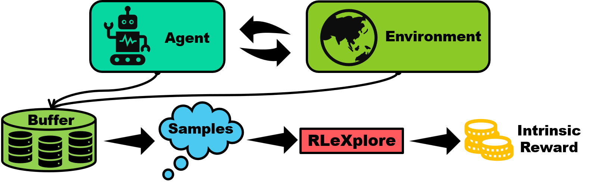

<div align=center>

</div>

=3.8-brightgreen"> =1.8.1-orange"> =0.21.1-%23252422">      


# Reinforcement Learning Exploration Baselines (RLeXplore)

RLeXplore is a set of implementations of exploration approaches in reinforcement learning using PyTorch, which can be deployed in arbitrary algorithms in a plug-and-play manner. 

<div align=center>

</div>

- See [Changelog](#changelog) and [Implemented Algorithms](#implemented-algorithms);
- Code test in progress! Welcome to contribute to this program!

# Installation
- Get the repository with git:
```
git clone https://github.com/yuanmingqi/rl-exploration-baselines.git
```
- Run the following command to get dependencies:
```shell
pip install -r requirements.txt
```

# Usage Example
In RLeXplore, the environments are assumed to be vectorized and the data shape of observations are ). Take RE3 for instance, it computes the intrinsic reward for each transition by

<div align=center>

</div>

where ) is a fixed representation from a random encoder and  is the -nearest
neighbor of  within a set of  representations . The following code provides a usage example of RE3:
```python
import torch
import numpy as np
from rlexplore.re3 import RE3

if __name__ == '__main__':
    ''' env setup '''
    device = torch.device('cuda:0')
    obs_shape = (4, 84, 84)
    action_shape = 7
    n_envs = 16 
    n_steps = 256 
    batch_obs = np.random.randn(n_steps, n_envs, *obs_shape).astype('float32')

    ''' create RE3 instance '''
    re3 = RE3(
        obs_shape=obs_shape, 
        action_shape=action_shape, 
        device=device,
        latent_dim=128,
        beta=0.05,
        kappa=0.00001)

    ''' compute intrinsic rewards '''
    intrinsic_rewards = re3.compute_irs(
        batch_obs=batch_obs,
        time_steps=25600,
        k=3,
        average_entropy=True)

    print(intrinsic_rewards.shape, type(intrinsic_rewards))
    print(intrinsic_rewards)

# Output: (256, 16, 1) <class 'numpy.ndarray'>
```

# Implemented Algorithms
| Algorithm | Remark                             | Year | Paper                                                                                                                                             | Code                                                                                    |
|:----------|:-----------------------------------|:-----|:--------------------------------------------------------------------------------------------------------------------------------------------------|:----------------------------------------------------------------------------------------|
| ICM       | Prediction-based exploration       | 2017 | [Curiosity-Driven Exploration by Self-Supervised Prediction](http://proceedings.mlr.press/v70/pathak17a/pathak17a.pdf)                            | [Link](https://github.com/yuanmingqi/rl-exploration-baselines/tree/main/rlexplore/icm)  |
| RND       | Novelty-based exploration          | 2019 | [Exploration by Random Network Distillation](https://arxiv.org/pdf/1810.12894.pdf)                                                                | [Link](https://github.com/yuanmingqi/rl-exploration-baselines/tree/main/rlexplore/rnd)  |
| GIRM      | Prediction-based exploration       | 2020 | [Intrinsic Reward Driven Imitation Learning via Generative Model](http://proceedings.mlr.press/v119/yu20d/yu20d.pdf)                              | [Link](https://github.com/yuanmingqi/rl-exploration-baselines/tree/main/rlexplore/girm) |
| NGU       | Memory-based exploration           | 2020 | [Never Give Up: Learning Directed Exploration Strategies](https://arxiv.org/pdf/2002.06038)                                                       | [Link](https://github.com/yuanmingqi/rl-exploration-baselines/tree/main/rlexplore/ngu)  |
| RIDE      | Procedurally-generated environment | 2020 | [RIDE: Rewarding Impact-Driven Exploration for Procedurally-Generated Environments](https://arxiv.org/pdf/2002.12292)                             | [Link](https://github.com/yuanmingqi/rl-exploration-baselines/tree/main/rlexplore/ride) |
| RE3       | Computation-efficient exploration  | 2021 | [State Entropy Maximization with Random Encoders for Efficient Exploration](http://proceedings.mlr.press/v139/seo21a/seo21a.pdf)                  | [Link](https://github.com/yuanmingqi/rl-exploration-baselines/tree/main/rlexplore/re3)  |
| RISE      | Computation-efficient exploration  | 2022 | [Rényi State Entropy Maximization for Exploration Acceleration in Reinforcement Learning](https://ieeexplore.ieee.org/abstract/document/9802917/) | [Link](https://github.com/yuanmingqi/rl-exploration-baselines/tree/main/rlexplore/rise) |

# Changelog
**03/12/2022**
- We start to reconstruct the project to make it compatible with arbitrary tasks;
- Update RE3 and RISE.

**27/09/2022**
- Update the RISE;
- Introduce JAX in RISE. See ```experimental``` folder.


**26/09/2022**
- Update the RE3;
- Try to introduce JAX to accelerate computation. See ```experimental``` folder.

# Acknowledgments
Some source codes of RLeXplore are built based on the following repositories:

- [stable-baselines3](https://github.com/DLR-RM/stable-baselines3)
- [GIRIL](https://github.com/xingruiyu/GIRIL)
- [never-give-up](https://github.com/Coac/never-give-up)
