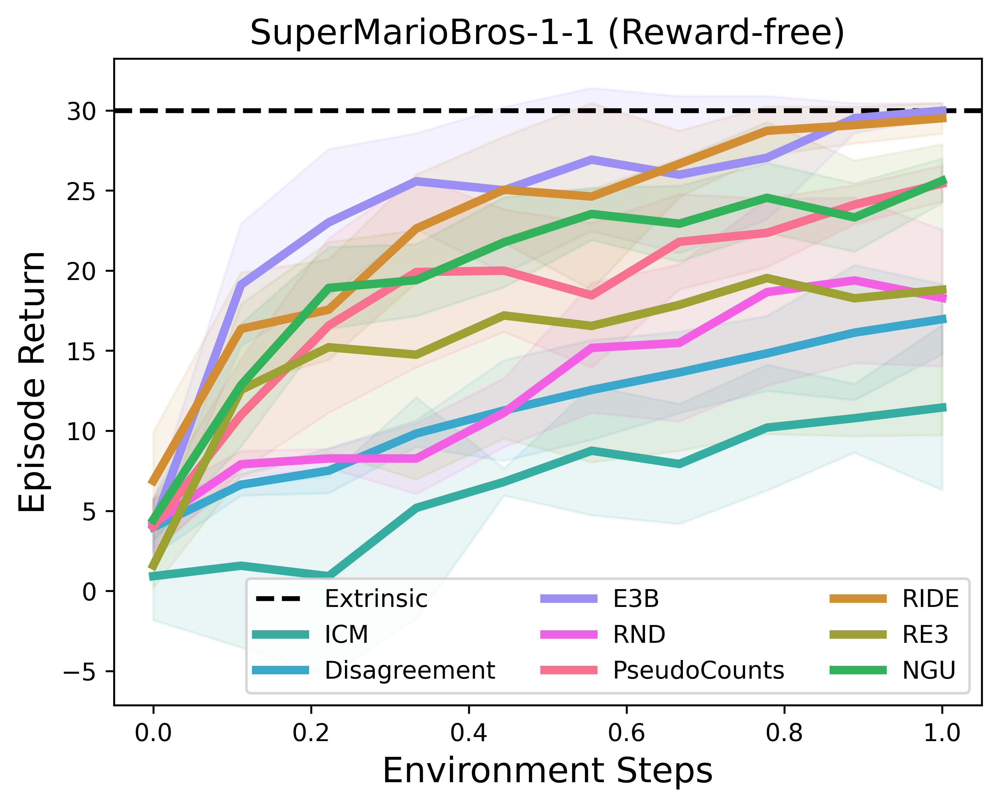

<div align=center>
<br>

<br>

## RLeXplore: Accelerating Research in Intrinsically-Motivated Reinforcement Learning
</div>

**RLeXplore** is a unified, highly-modularized and plug-and-play toolkit that currently provides high-quality and reliable implementations of eight representative intrinsic reward algorithms. It used to be challenging to compare intrinsic reward algorithms due to various confounding factors, including distinct implementations, optimization strategies, and evaluation methodologies. Therefore, RLeXplore is designed to provide unified and standardized procedures for constructing, computing, and optimizing intrinsic reward modules.

The workflow of RLeXplore is illustrated as follows:
<div align=center>

</div>

# Installation
- with pip `recommended`

Open a terminal and install **rllte** with `pip`:
``` shell
conda create -n rllte python=3.8
pip install rllte-core 
```

- with git

Open a terminal and clone the repository from [GitHub](https://github.com/RLE-Foundation/rllte) with `git`:
``` sh
git clone https://github.com/RLE-Foundation/rllte.git
pip install -e .
```

Now you can invoke the intrinsic reward module by:
``` python
from rllte.xplore.reward import ICM, RIDE, ...
```

## Module List
| **Type** 	| **Modules** 	|
|---	|---	|
| Count-based 	| [PseudoCounts](https://arxiv.org/pdf/2002.06038), [RND](https://arxiv.org/pdf/1810.12894.pdf), [E3B](https://proceedings.neurips.cc/paper_files/paper/2022/file/f4f79698d48bdc1a6dec20583724182b-Paper-Conference.pdf) 	|
| Curiosity-driven 	| [ICM](http://proceedings.mlr.press/v70/pathak17a/pathak17a.pdf), [Disagreement](https://arxiv.org/pdf/1906.04161.pdf), [RIDE](https://arxiv.org/pdf/2002.12292) 	|
| Memory-based 	| [NGU](https://arxiv.org/pdf/2002.06038) 	|
| Information theory-based 	| [RE3](http://proceedings.mlr.press/v139/seo21a/seo21a.pdf) 	|

## Tutorials
Click the following links to get the code notebook:

0. [Quick Start](./0%20quick_start.ipynb)
1. [RLeXplore with RLLTE](./1%20rlexplore_with_rllte.ipynb)
2. [RLeXplore with Stable-Baselines3](./2%20rlexplore_with_sb3.ipynb)
3. [RLeXplore with CleanRL](./3%20rlexplore_with_cleanrl.py)
4. [Exploring Mixed Intrinsic Rewards](./4%20mixed_intrinsic_rewards.ipynb)
4. [Custom Intrinsic Rewards](./5%20custom_intrinsic_reward.ipynb)

## Benchmark Results
- `RLLTE's PPO+RLeXplore` on *SuperMarioBros*:

<div align=center>

</div>

- `CleanRL's PPO+RLeXplore's RND` on *Montezuma's Revenge*:


## Cite Us
To cite this repository in publications:

``` bib
@software{yuan_roger@rlexplore,
	author = {Mingqi Yuan and Roger Creus Castanyer and Bo Li and Xin Jin and Glen Berseth and Wenjun Zeng},
	title = {RLeXplore: Accelerating Research in Intrinsically-Motivated Reinforcement Learning},
	url = {https://github.com/Farama-Foundation/Minigrid},
	year = {2024},
}
```
